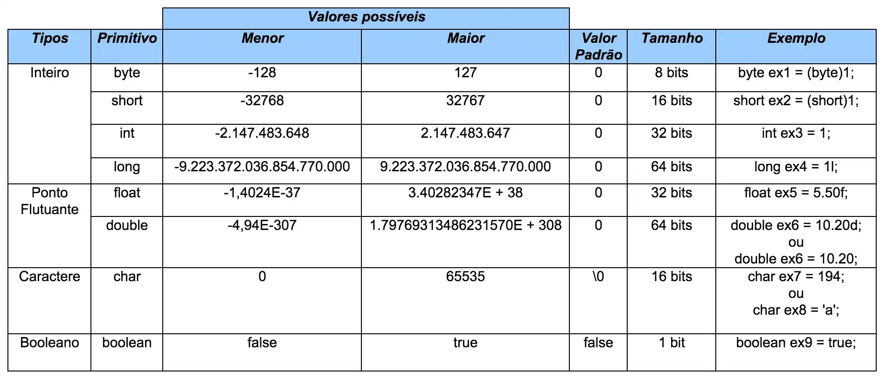

# Aula 02: Tipos e Variáveis

Java é uma linguagem fortemente tipada, ou seja, obrigatoriamente exige a definição dos tipos de variáveis, retornos ou constantes.

Hoje iremos ver quais são os tipos de variáveis existentes nessa linguagem.

## Tipos Primitivos

Os tipos mais utilizados na linguagem são `int`, `double`, `char` e `boolean`. Entretanto, é sempre bom definir o tipo correto de variável para não consumir desnecessariamente a memória do seu computador.

Por exemplo, não faz sentido escolher `long` para armazenar o valor `50`, pois `int` já seria suficiente.

### Tipos Primitivos em Java:


```java
byte idadePequena = 25;      // Armazena um número pequeno
short populacaoCidade = 30000; // Armazena um número médio
int idade = 25;              // Armazena um número inteiro
long distancia = 15000000000L; // Armazena um número grande
float altura = 1.75f;        // Armazena um número decimal (precisa do sufixo 'f')
double preco = 99.99;        // Armazena um número decimal com maior precisão
char letra = 'A';            // Armazena um caractere
boolean ligado = true;       // Armazena um valor verdadeiro ou falso
```

# Constantes

Sabemos como definir variáveis, mas como definimos uma constante?

Uma constante é uma variável cujo valor não pode ser alterado após sua inicialização. Ou seja, uma vez atribuído, ele permanece o mesmo durante toda a execução do programa.

Alguns exemplos de valores constantes são o valor de PI (`3.14159`) ou valores de datas/horas que não devem ser modificados.

Na linguagem Java, definimos uma constante com a palavra-chave `final`, da seguinte maneira:

```java 
final double PI = 3.14159;
final int ANO_ATUAL = 2024;
```
Caso tente modificar o valor de uma constante após sua declaração, o compilador retornará um erro.